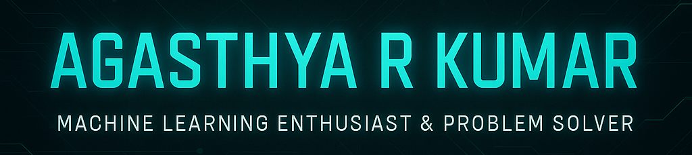

  

<!-- Rest of your existing README content goes here -->

## 💫 About Me

  Hello! I'm <strong>Agasthya R Kumar</strong>, a B.Tech. candidate at Dayananda Sagar University, Bengaluru (2026). 
  I thrive on crafting cutting-edge ML solutions and have deep expertise in:

<ul>
  <li>🔬 <strong>ECG Signal Analysis:</strong> Multi-class cardiovascular disease classification</li>
  <li>🐾 <strong>Computer Vision:</strong> Animal Face Recognition</li>
  <li>🔊 <strong>Audio Processing:</strong> Sound Analysis & Digit Generation</li>
</ul>

  Currently sharpening my <strong>JavaScript</strong> skills to seamlessly integrate ML into interactive web applications.

## 🌐 Connect with Me

  
  

## 💻 Tech Stack & Proficiency

  <!-- Skill Bar: Python -->
  
  
  

  
  
  

  
  
  

## 🏆 Stats & Achievements

  

  
  

## 🎵 Current Vibes

  
  
<em>Focus Mode: Activated 🎧</em>

## ✍️ Quote

<blockquote align="center" style="font-style:italic;">
  "Code is like humor. When you have to explain it, it’s bad." – Cory House
</blockquote>

## ⚡ Fun Fact

  🌌 I can debug ML models while listening to space ambient mixes for hours!

  

